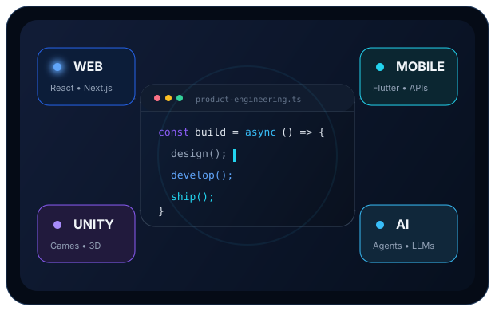
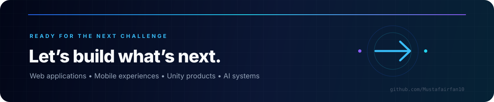

  

  

📊 Impact snapshot

<table align="center">
  <tr>
    <td align="center" width="25%">
      <h2>3+ Years</h2>
      Development experience
    </td>
    <td align="center" width="25%">
      <h2>4 Domains</h2>
      Web • Mobile • Games • AI
    </td>
    <td align="center" width="25%">
      <h2>6 Projects</h2>
      Selected professional work
    </td>
    <td align="center" width="25%">
      <h2>Remote</h2>
      Global collaboration
    </td>
  </tr>
</table>

👋 About me

I’m Mustafa Irfan, a software engineer and founder focused on turning ideas into reliable web, mobile, and AI-powered products. I enjoy working at the intersection of automation, product engineering, and security-minded development.

🔭 Software Engineer at Dhao AI

🚀 Founder at DivLynx Inc.

🤖 Building with AI agents, LLM workflows, automation, and full-stack systems

🛡️ Interested in secure AI systems, MCP security, and application security

🌍 Based in Islamabad, Pakistan — working remotely

💬 Open to collaborating on AI, web, mobile, automation, and security projects

 

⚡ Tech stack

  

  

 

<table>
  <tr>
    <td width="50%" valign="top">
      
      <h3>Website redesign and rebuild</h3>
      
A full rebuild of a marketing site on a headless stack the team can edit independently.

      <code>Next.js</code> <code>Nest.js</code> <code>Tailwind</code> <code>shadcn/ui</code>
    </td>
    <td width="50%" valign="top">
      
      <h3>E-commerce storefront</h3>
      
Catalogue, cart, and checkout built to survive campaign traffic spikes.

      <code>React</code> <code>Node.js</code> <code>Tailwind</code>
    </td>
  </tr>
  <tr>
    <td width="50%" valign="top">
      
      <h3>Subscription platform</h3>
      
Plan management, billing states, and a self-serve account area.

      <code>SaaS</code> <code>Billing</code> <code>Web App</code>
    </td>
    <td width="50%" valign="top">
      
      <h3>Hotel reception voice agent</h3>
      
Takes reservations around the clock, understands accents, and escalates to a human on request.

      <code>Python</code> <code>Rasa</code> <code>Twilio</code> <code>NLP</code>
    </td>
  </tr>
  <tr>
    <td width="50%" valign="top">
      
      <h3>Cricket management app</h3>
      
Fixtures, live scoring, and squad management across web and mobile.

      <code>React</code> <code>Express</code> <code>MongoDB</code>
    </td>
    <td width="50%" valign="top">
      
      <h3>Zero-downtime deployment pipeline</h3>
      
Containerised delivery with infrastructure as code and automated rollbacks.

      <code>AWS</code> <code>Docker</code> <code>Kubernetes</code> <code>Terraform</code>
    </td>
  </tr>
</table>

  
    
  ↓ Explore my pinned repositories for the code, demos, and latest updates ↓

💼 Experience

<table>
  <tr>
    <td width="20%" align="center" valign="middle">
      <b>2026 — Present</b> 
      Current role
    </td>
    <td width="80%" valign="top">
      <h3>Software Engineer · Dhao AI</h3>
      
Building production-ready software across web, mobile, and backend systems.

      <code>Python</code> <code>Flutter</code> <code>REST APIs</code> <code>Full-stack</code>
    </td>
  </tr>
  <tr>
    <td width="20%" align="center" valign="middle">
      <b>2026 — Present</b> 
      Contract
    </td>
    <td width="80%" valign="top">
      <h3>Senior Game Designer · DevDaa</h3>
      
Designing game systems and collaborating on Unity-based interactive experiences.

      <code>Game Design</code> <code>Unity</code> <code>Interactive Systems</code>
    </td>
  </tr>
  <tr>
    <td width="20%" align="center" valign="middle">
      <b>2023 — Present</b> 
      Freelance
    </td>
    <td width="80%" valign="top">
      <h3>Web Development Specialist · Upwork</h3>
      
Delivering responsive web applications, integrations, and client-focused solutions.

      <code>Web Development</code> <code>Integrations</code> <code>Client Delivery</code>
    </td>
  </tr>
</table>

📈 GitHub activity

  
  

  

🎯 Current priorities

<table>
  <tr>
    <td width="50%" valign="top">
      
      <h3>AI agents & MCP hardening</h3>
      
Designing safer agent workflows, stronger policy controls, and more resilient AI systems.

    </td>
    <td width="50%" valign="top">
      
      <h3>Production AI automation</h3>
      
Turning repetitive processes into reliable, maintainable, and measurable workflows.

    </td>
  </tr>
  <tr>
    <td width="50%" valign="top">
      
      <h3>Modern product experiences</h3>
      
Building responsive React, Next.js, and Flutter interfaces with thoughtful user journeys.

    </td>
    <td width="50%" valign="top">
      
      <h3>Scalable delivery architecture</h3>
      
Strengthening cloud, DevOps, deployment, and application architecture foundations.

    </td>
  </tr>
</table>

  
  
    
  

